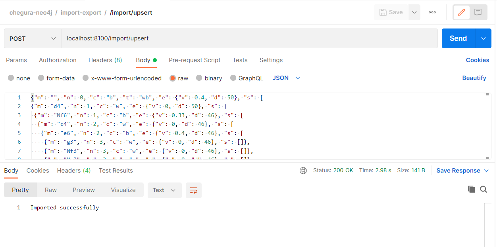
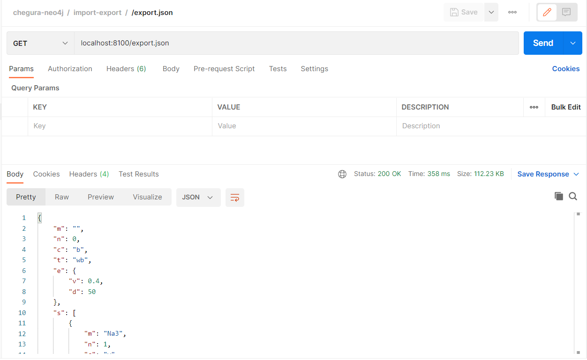
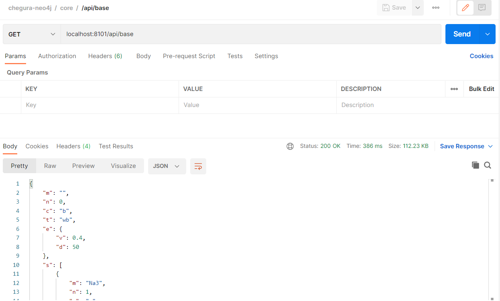
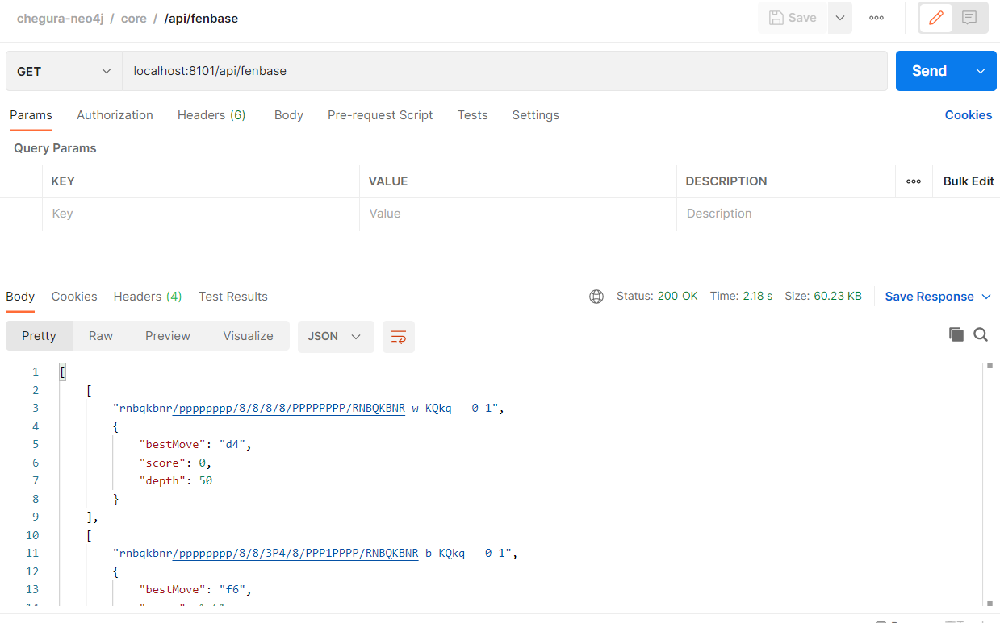
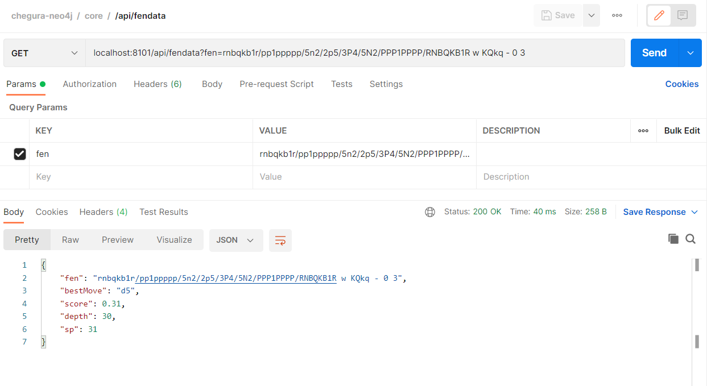

# chegura-neo4j
POC for [chegura](https://github.com/Scorpibear/chegura) to work with neo4j db.

## Installation
 * Neo4j community edition - https://neo4j.com/download-center/#community
   * After dowload you would be provided with DB installation instruction
   * Default db name - 'neo4j'
 * Each service execution instructions available in respective folders

## Services
 * chegura-neo4j-import-export
   * service handling import and export of chess moves in json format
   * runs on port 8100
 * chegura-neo4j-core
   * service handling general API operations
   * runs on port 8101

## Preview
 * Postman collection with sample requests - [chegura-neo4j.postman_collection.json](chegura-neo4j.postman_collection.json)
 * Preview images of postman request-respone - 

   * /import/upsert
    
   * /export.json
   
   * /api/base
   
   * /api/fenbase
   
   * /api/fendata
   
